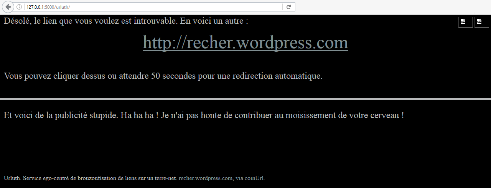

# Exécution du site urluth en local

Le fichier python principal `repo_git/urluth/server/mysite/flask_app.py` essaie d'importer deux Blueprints : "urluth" et "expressionotron". S'il en manque un, ou les deux, le site démarrera quand même, car les échecs d'imports sont non bloquants.

Dans le cas de ce repository, seul "urluth" est présent.

## Récupération du code

Clonez ou copiez ce repository sur votre disque. Dans la suite de cette documentation, on suppose qu'il est placé dans `C:\urluth`

## Installation des dépendances

Installez le python 3.4 ou une version 3.x supérieure : [https://www.python.org/](https://www.python.org/). Je vous laisse vous débrouiller pour les détails.

La lib Flask est nécessaire. Normalement, son installation s'effectue avec une simple commande `pip install Flask`. Mais il semblerait que des fois, ce soit un peu plus compliqué (en particulier sous Windows XP). Voir : [install_pip_and_flask.md](install_pip_and_flask.md)

## Vérification des versions installées

Démarrez une fenêtre de commande. (Windows, Linux, Mac ou autre, selon votre système).

    C:\>python
    Python 3.4.4 (v3.4.4:737efcadf5a6, Dec 20 2015, 20:20:57) [MSC v.1600 64 bit (AM
    D64)] on win32
    Type "help", "copyright", "credits" or "license" for more information.
    >>> import flask
    >>> flask.__version__
    '0.10.1'
    >>> exit()

## Lancement du site en local

Démarrez une fenêtre de commande et allez dans le répertoire contenant le repository, `C:\urluth` dans notre exemple.

    C:\urluth>cd server
    C:\urluth\server>cd mysite
    C:\urluth\server\mysite>python flask_app.py
     * Running on http://127.0.0.1:5000/ (Press CTRL+C to quit)

Démarrez un navigateur web quelconque et allez à l'adresse : `http://127.0.0.1:5000/`

Vous devriez voir une page web toute simple, avec le texte suivant.

> Il n'y a pas grand-chose ici. Vous pouvez juste :
> - cliquez ici pour consulter urluth

Cliquez sur le lien. Vous devriez voir la page web suivante :

Le site ne fonctionne pas complètement, car les fichiers statiques (images et javascript) ne sont pas servis par flask. Les publicités peuvent éventuellement apparaître, selon leur humeur et votre configuration d'AdBlock.

Dans la fenêtre de commande, les logs de flask montrent bien que les fichiers statiques ne sont pas servis.

    127.0.0.1 - - [08/Jan/2017 11:28:29] "GET / HTTP/1.1" 200 -
    127.0.0.1 - - [08/Jan/2017 11:28:30] "GET /favicon.ico HTTP/1.1" 404 -
    127.0.0.1 - - [08/Jan/2017 11:28:30] "GET /favicon.ico HTTP/1.1" 404 -
    127.0.0.1 - - [08/Jan/2017 11:28:40] "GET /urluth/ HTTP/1.1" 200 -
    127.0.0.1 - - [08/Jan/2017 11:28:40] "GET /urluth/img/drapalfr.png HTTP/1.1" 404 -
    127.0.0.1 - - [08/Jan/2017 11:28:40] "GET /urluth/js/urluth_index.js HTTP/1.1" 404 -
    127.0.0.1 - - [08/Jan/2017 11:28:40] "GET /urluth/img/drapalen.png HTTP/1.1" 404 -

Il est possible de configurer flask pour qu'ils soient envoyés, mais je n'ai pas cherché à savoir comment faire. Dans pythonanywhere, ces fichiers sont bien évidemment correctement mis à disposition.

En local, il est possible de tester la correspondance entre l'identifiant passé en paramètre et son url. Avec le navigateur web, allez à l'url suivante : `http://127.0.0.1:5000/urluth/?u=ah`. La page affichée devrait contenir un lien vers le blog CommitStrip.

Pour arrêtez le serveur flask : retournez à la fenêtre de commande et utilisez le raccourci Ctrl+C.
