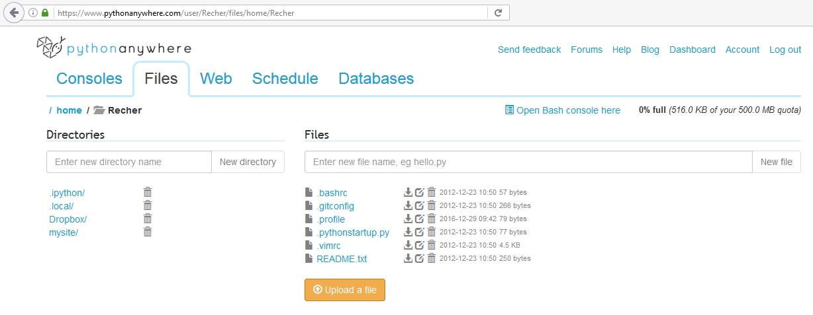
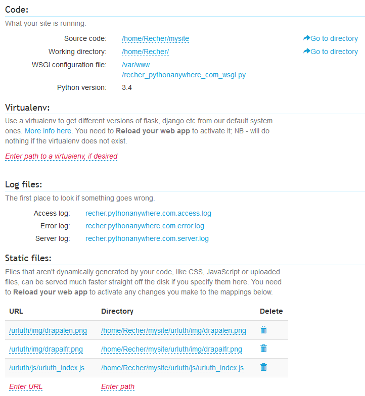

# Mise en production du site dans pythonanywhere.com

Il n'y a rien d'automatisé. La mise à jour des fichiers et de la configuration doit être faite manuellement.

## Création du compte

Je ne sais plus exactement ce que j'ai fais, mais c'est assez simple.

## Arborescence des fichiers

Pour afficher l'arborescence dans pythonanywhere, cliquer sur l'onglet "Files".

L'arborescence est la suivante :

 - `/home/`
    * `Recher/`
        + `.ipython`/ : non versionné. Créé par pythonanywhere. Non modifié.
        + `.local/`
            - `bin/` : non versionné. Créé par pythonanywhere. Non modifié.
        + `Dropbox/` : répertoire vide
        + `mysite/`
            - `__pycache__/` : non versionné. Géré automatiquement par le python.
            - `expressionotron/` : non versionné dans ce repo. Correspond à l'autre application. Facultatif.
            - `urluth/` : contient l'application. Correspond au répertoire [repo_git/server/mysite/urluth](../server/mysite/urluth)
            - `flask_app.py` : fichier principal du site. Correspond à [repo_git/server/mysite/flask_app.py](../server/mysite/flask_app.py)
            - `secret_key.py` : fichier contenant la clé secrète du site. Non versionné (le fichier dans ce repository contient une clé par défaut).
            - `twitCron.py` : fichier non versionné dans ce repository. Utilisé par l'application expressionotron. Facultatif.
        + `.bashrc` : créé par pythonanywhere. Correspond à [repo_git/server/.bashrc.txt](../server/.bashrc.txt)
        + `.gitconfig` : créé par pythonanywhere. Correspond à [repo_git/server/.gitconfig.txt](../server/.gitconfig.txt)
        + `.profile` : créé par pythonanywhere. Correspond à [repo_git/server/.profile.txt](../server/.profile.txt)
        + `.pythonstartup.py` : créé par pythonanywhere. Correspond à [repo_git/server/.pythonstartup.py](../server/.pythonstartup.py)
        + `.vimrc` : créé par pythonanywhere. Correspond à [repo_git/server/.vimrc.txt](../server/.vimrc.txt)
        + `README.txt` : créé par pythonanywhere. Correspond à [repo_git/server/README.txt](../server/README.txt)

Les fichiers à la racine du site : `.bashrc`, `.gitconfig`, `.profile`, `.vimrc` sont enregistré avec l'extension `.txt` dans le repository, alors qu'ils n'en ont pas dans pythonanywhere. Je travaille sous Windows et on ne peut pas créer de fichier commençant par un point et n'ayant pas d'extension. Désolé.

## Configuration du site

La config se fait dans l'onglet "Web".

App : Recher.pythonanywhere.com

### Code

 - Source code : `/home/Recher/mysite`
 - Working directory : `/home/Recher/`
 - WSGI configuration file : `/var/www/recher_pythonanywhere_com_wsgi.py`
 - Python version : 3.4

La version de python 3.4 est celle par défaut sur pythonanywhere. Pas besoin de configurer autrement.

### Virtualenv

Pas de virtualenv

### Log files

 - Access log : `recher.pythonanywhere.com.access.log`
 - Error log : `recher.pythonanywhere.com.error.log`
 - Server log : `recher.pythonanywhere.com.server.log`

### Static files

URL                        | Directory
---------------------------|---------------
/urluth/img/drapalen.png   | `/home/Recher/mysite/urluth/img/drapalen.png`
/urluth/img/drapalfr.png   | `/home/Recher/mysite/urluth/img/drapalfr.png`
/urluth/js/urluth_index.js | `/home/Recher/mysite/urluth/js/urluth_index.js`

### Password protection

Aucune

## Tâches planifiées

Les tâches planifiées sont configurées dans l'onglet "Schedule".

Il y en a une, mais elle est pour l'application expressionotron. Elle n'est donc pas décrite dans la doc de ce repository.

## Bases de données

Configurées dans l'onglet "Databases".

Mais il n'y a aucule base de données.

